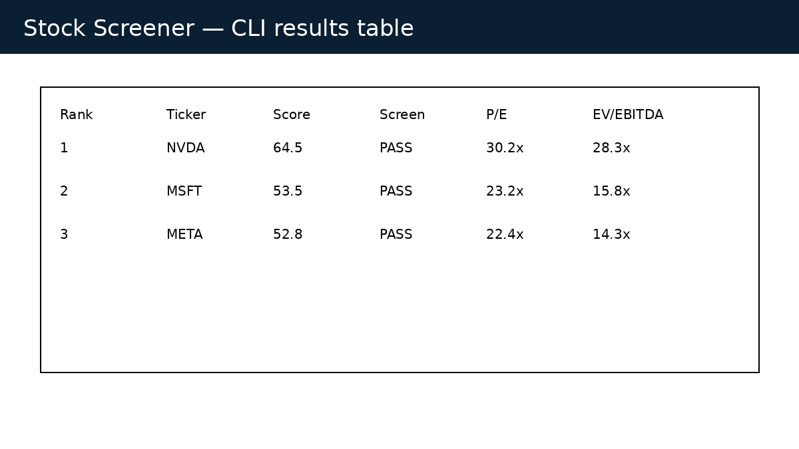
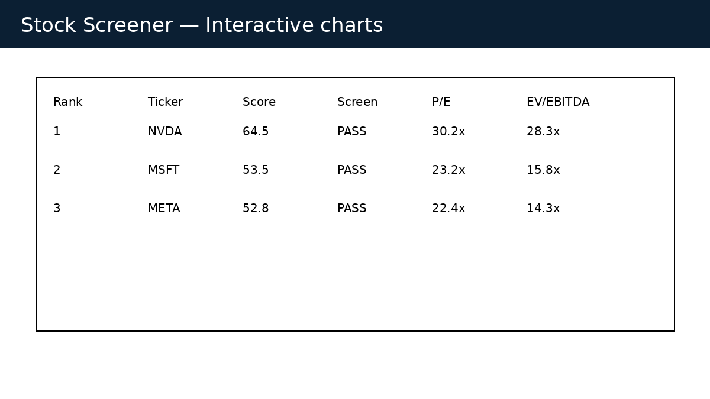
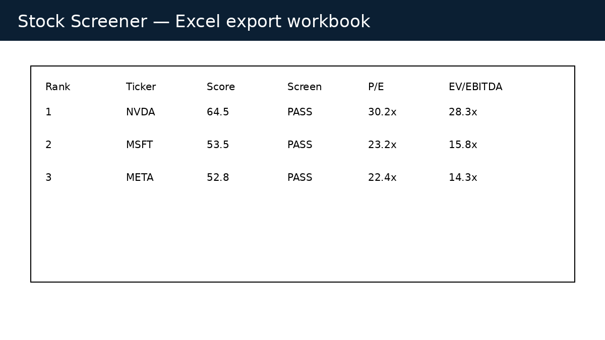

# Investment Stock Screener

Production-quality Python stock screener for investment analysts. The project uses async data collection, disk caching, retry logic, configurable filters, weighted scoring, Excel export, and interactive Plotly charts.


## Highlights

- Modular architecture with provider, pipeline, screening, scoring, and exporter layers
- Async concurrent market-data collection using `asyncio`
- Retry logic via `tenacity`
- JSON disk cache with TTL
- Structured logging with Rich
- Config-driven filters and score weights
- Excel and interactive HTML chart exports
- Unit tests, GitHub Actions CI, Dockerfile, Ruff/Black, pre-commit, Makefile
- Architecture diagrams and screenshot assets

## Quick start

```bash
python -m venv .venv
source .venv/bin/activate
pip install -e '.[dev]'
stock-screener --config config/default_config.yaml
```

## Docker

```bash
docker build -t investment-stock-screener .
docker run --rm -v "$PWD/sample_outputs:/app/sample_outputs" investment-stock-screener
```

## Configuration

Edit `config/default_config.yaml` to change ticker universe, filter thresholds, scoring weights, cache TTL, and output paths.

## Scoring methodology

Lower is better for P/E, EV/EBITDA, and debt-to-equity. Higher is better for ROE, revenue growth, FCF growth, gross margin, and market cap. Metrics are normalized 0–1 and multiplied by configurable weights.

## Analyst workflow

1. Define a sector or portfolio ticker universe.
2. Configure quality, growth, balance-sheet, and valuation filters.
3. Run the screener and review pass/fail flags.
4. Use weighted score ranking to identify follow-up diligence candidates.
5. Export Excel outputs into pitch books, IC memos, or monitoring dashboards.

## Screenshots





## Architecture

See [docs/architecture.md](docs/architecture.md).

## Development

```bash
make install
make lint
make test
make run
```

## Data note

Default provider uses public Yahoo Finance data through `yfinance`. Public data can be incomplete or stale; validate outputs against filings or institutional data providers before making investment decisions.
