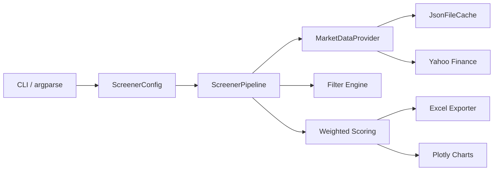

# Architecture

## Design patterns

- **Provider interface** isolates data sources from screening logic.
- **Pipeline orchestration** keeps CLI thin and testable.
- **Functional filter/scoring modules** are deterministic and unit-testable.
- **Cache + retry layer** improves reliability for public APIs.
- **Exporters** separate presentation from analytics.
